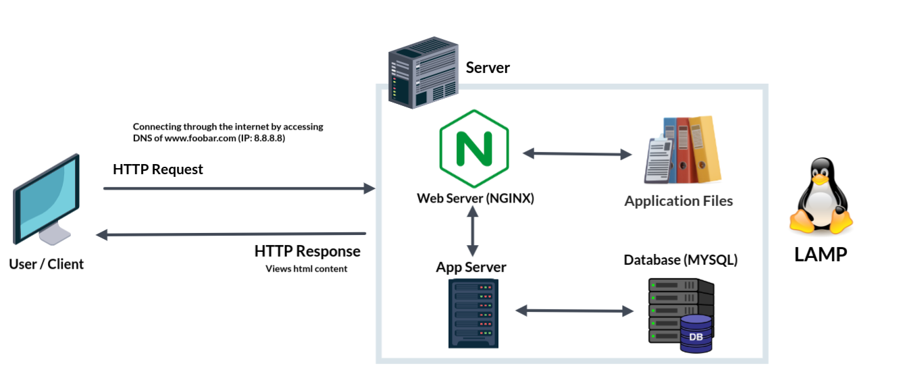

# Simple Web Stack

| <a href="">Visit the board</a> |

## Explaining specifics about this infrastructure

+ What a server is?:  
A server is a piece of computer hardware or software that provides functionality for other programs or devices, called "clients", it can be either physical or virtual.

+ The role of a domain:  
Provides a human-friendly alias for an IP address.

+ The role of the DNS:  
Translates the record of a domain name into an IP address.

+ The type of DNS record "www" in "www.foobar.com":  
It is an **A** record as it resolves to an IP address.

+ The role of web server:  
It is a software/hardware that accepts requests via HTTP/HTTPs and responds with the content of the requested web-page.

+ The role of application server:  
Installs, operats and hosts applications and associated servers for end-users.

+ The role of the database:  
Maintains a collection of organized information that can easily be accessed, managed and updated.

+ What the server uses to communicate with the client:  
The server uses TCP/IP to communicate.

## Issues With This Infrastrucutre

+ This server is a SPOF (Single Point of Failure) because nothing is redundant.

+ There are multiple SPOF (Single Point Of Failure) in this infrastructure.

+ This website would be temporarily down when new code is deployed and the web server needs to be restarted.

+ Downtime when maintenance needed, since there's only one server, the website would be experiencing a downtime if something where to happen.

+ This infrastructure cannot scale if there's too much incoming traffic.
