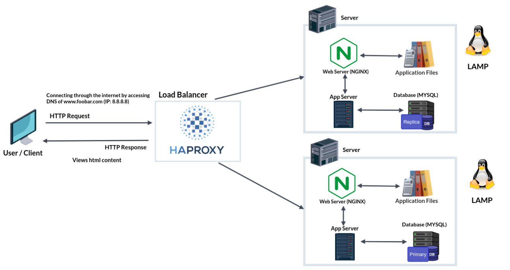

# Simple Web Stack

| <a href="">Visit the board</a> |

## Explaining specifics about this infrastructure

+ Why did you add a new server?  
Added another server so that there is redundancy with the other one.

+ How is the load-balancer configured and how it works?   
The HAProxy load balancer is configured with the *Round Robin* distribution algorithm. This algorithm works by using each server behind the load balancer in turns, according to their weights. *Round Robin* allows server weights to be adjusted on the go.

+ The setup enabled by load-balancer:  
A load balancer is added to distribute traffic between the 2 servers (or failover). The HAProxy load-balancer is enabling an *Active-Passive* setup rather than an *Active-Active* setup. In an *Active-Active* setup, the load balancer distributes workloads across all nodes in order to prevent any single node from getting overloaded. In the case of two nodes, for example, if the first node is already active, the second node must be passive or on standby.

+ How a database "Primary-Replica" cluster works:  
The *Primary* server is capable of performing read/write requests whilst the *Replica* server is only capable of performing read requests.

+ Difference between *Primary* & *Replica* nodes in regard to the application:  
The *Primary* node is responsible for all the write operations the site needs whilst the *Replica* node is capable of processing read operations, which decreases the read traffic to the *Primary* node.

## Issues With The Infrastructure

+ There is no fire-wall to protect.
+ Traffic is un-encrypted.
+ No monitoring.
+ There are multiple SPOFs.
