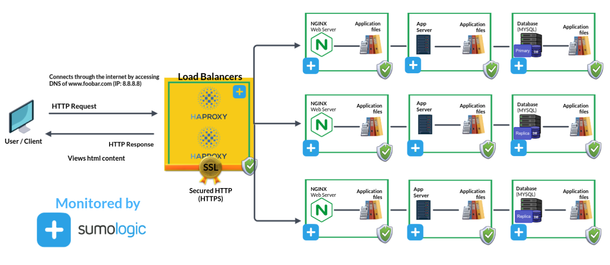

# Simple Web Stack

| <a href="">Visit the board</a> |

## Explaining specifics about this infrastructure

+ Addition of fire-wall between each server:  
This protects each server from unwanted and unauthorized users rather than protecting a single server.

## Issues With This Infrastrucutre

+ High maintenance costs.
